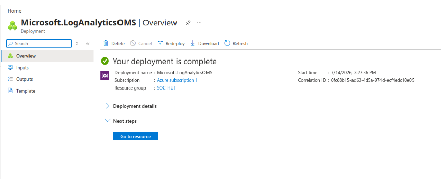
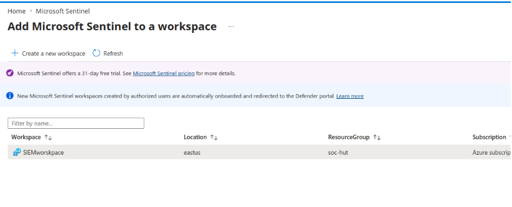
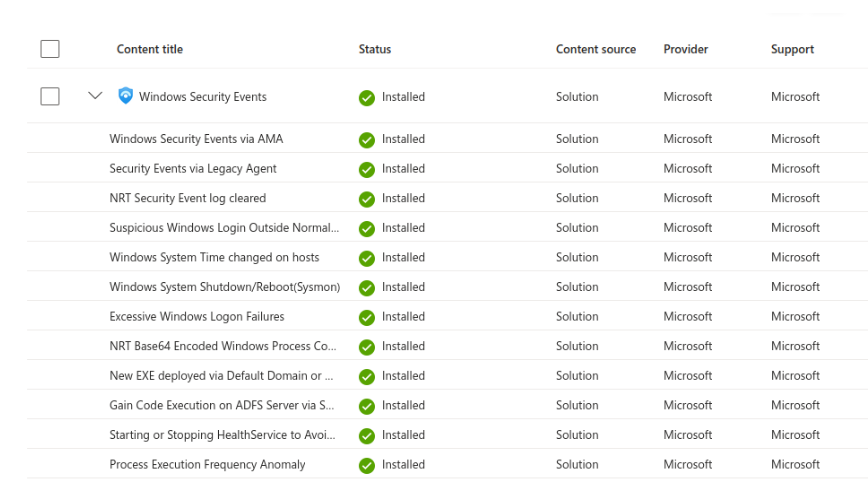
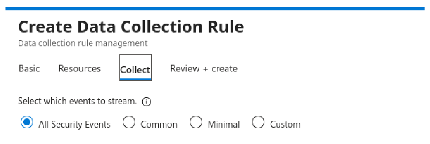
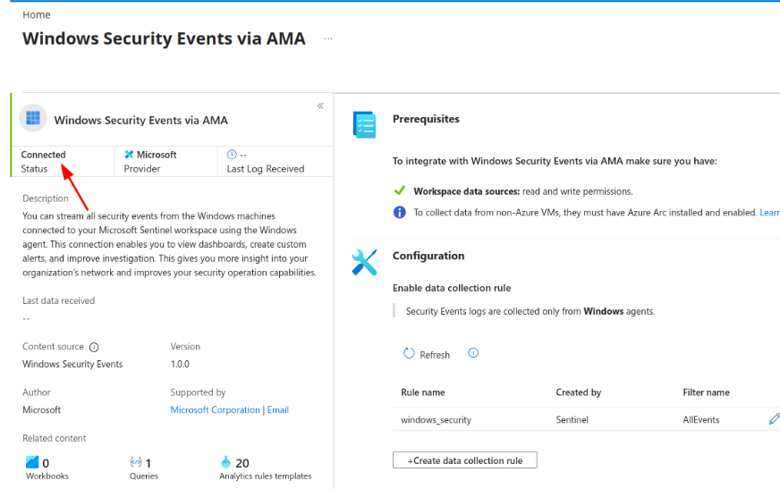

# Lab 01: Cloud SIEM Foundation & Azure Monitor Agent (AMA) Ingestion

## Overview
This module deploys Microsoft Sentinel over an Azure Log Analytics Workspace (LAW). Telemetry ingestion is established using modern Azure Monitor Agent (AMA) pipelines and Data Collection Rules (DCR) to capture OS-level security events from provisioned endpoints.

```text
+---------------------------------------------------------------------------------+
|                        Azure Cloud Platform (East US)                           |
+---------------------------------------------------------------------------------+
|                                                                                 |
|   Resource Group: SOC-HUT                                                       |
|                                                                                 |
|   +--------------------------+           +----------------------------------+   |
|   | Windows 10 Enterprise VM |           |     Log Analytics Workspace      |   |
|   |      (User-Machine)      |           |         (SIEMworkspace)          |   |
|   |                          |           |                                  |   |
|   |  - Windows Event Logs    |   DCR     |  - Event Ingestion Engine        |   |
|   |  - Azure Monitor Agent   | --------> |  - Centralized Telemetry Store   |   |
|   |    (AMA Extension)       |           |                                  |   |
|   +--------------------------+           +-----------------+----------------+   |
|                                                            |                    |
|                                                            v                    |
|                                          +----------------------------------+   |
|                                          |        Microsoft Sentinel        |   |
|                                          |   - Cloud-Native SIEM / SOAR     |   |
|                                          |   - Content Hub Connectors       |   |
|                                          +----------------------------------+   |
+---------------------------------------------------------------------------------+
```

---

## 1. Cloud Workspace & Sentinel Initialization

1. **Resource Group Creation:** Provisioned logical container `SOC-HUT` within region `East US`.
2. **Log Analytics Workspace:** Deployed `SIEMworkspace` on the Pay-As-You-Go per-GB retention model to serve as the underlying data store.
3. **Microsoft Sentinel Onboarding:** Initialized the Microsoft Sentinel solution directly on top of `SIEMworkspace`.




---

## 2. Windows Virtual Machine Deployment
* **Asset Name:** `User-Machine`
* **OS:** Windows 10 Enterprise, version 22H2 - x64 Gen2
* **Size:** `Standard_B2as_v2` (2 vCPUs, 8 GiB RAM)
* **Inbound Access:** RDP (TCP 3389) enabled for remote testing.

---

## 3. Data Collection Rule (DCR) via Content Hub

1. Navigated to **Microsoft Sentinel > Content Management > Content Hub**.
2. Installed the **Windows Security Events** solution.
3. Configured the **Windows Security Events via AMA** connector.
4. Created a Data Collection Rule named `windows_security`:
   * **Scope:** `Azure subscription 1 / SOC-HUT / User-Machine`
   * **Collection Tier:** `All Security Events`




---

## 4. Ingestion Pipeline Verification
Verified telemetry streaming from `User-Machine` into the `SecurityEvent` table:

```kql
SecurityEvent
| take 10
```


