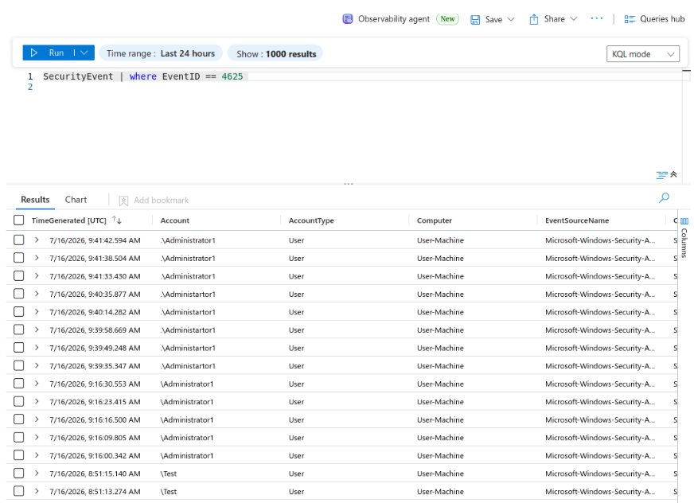
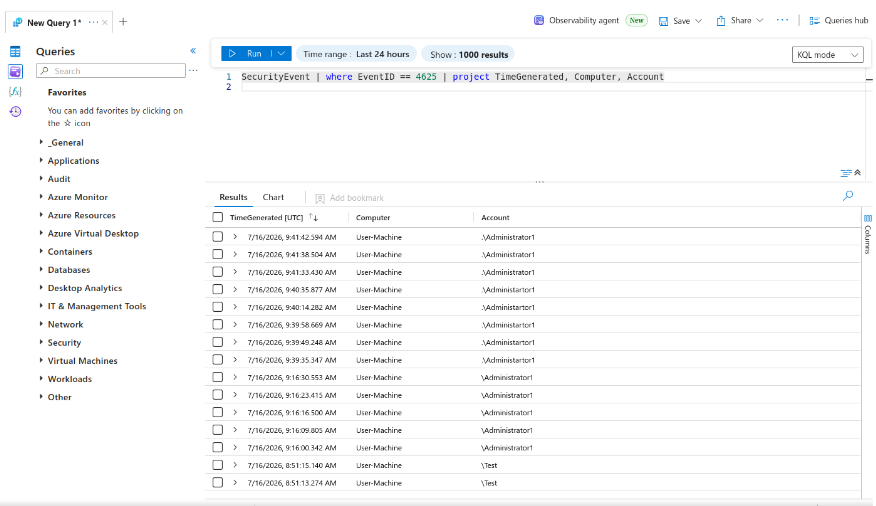
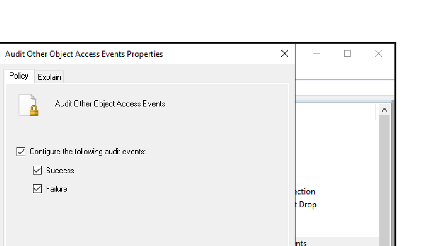
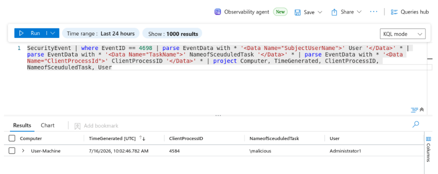

# Lab 02: Windows Threat Detection & Kusto Query Language (KQL) Analytics

## Overview
This module demonstrates threat hunting and behavioral log analysis using Kusto Query Language (KQL) in Microsoft Sentinel[cite: 3]. Attack simulations replicate RDP brute-force attempts and persistence mechanisms established via malicious Windows Scheduled Tasks[cite: 3].

---

## 1. RDP Brute-Force Authentication Detection

### Adversary Behavior
Repeated invalid password attempts were initiated against target `User-Machine` over RDP[cite: 3].

### KQL Analytics: Failed Logon Queries
Isolates failed authentication events (Event ID 4625)[cite: 3]:

```kql
SecurityEvent
| where EventID == 4625
| where TargetUserName == "Administrator1"
| project TimeGenerated, Computer, Account, SubStatus
```




---

## 2. Scheduled Task Persistence Mechanism (MITRE T1053.005)

### OS-Level Audit Configuration
To ensure task creation telemetry was generated by Windows auditing, Advanced Audit Policies were updated on the endpoint[cite: 3]:
* **Path:** `Local Security Policy > Advanced Audit Policy Configuration > System Audit Policies > Object Access`[cite: 3]
* **Subcategory:** `Audit Other Object Access Events` (Configured: Success + Failure)[cite: 3]



### Malicious Task Simulation
1. Created a destructive payload script `malicious.bat` designed to wipe user files[cite: 3]:
   ```cmd
   @echo off
   del /f /q "C:\Users\Administrator1\Downloads\*.*"
   ```
2. Scheduled execution via Windows Task Scheduler under task name `malicious`[cite: 3].

### KQL Detection & XML String Parsing
When Event ID 4698 triggers, the task details are encapsulated in raw XML inside `EventData`[cite: 3]. KQL `parse` operators extract the operational metadata into dedicated analysis columns[cite: 3]:

```kql
SecurityEvent
| where EventID == 4698
| parse EventData with * '<Data Name="SubjectUserName">' User '</Data>' *
| parse EventData with * '<Data Name="TaskName">' NameofScheduledTask '</Data>' *
| parse EventData with * '<Data Name="ClientProcessId">' ClientProcessID '</Data>' *
| project Computer, TimeGenerated, ClientProcessID, NameofScheduledTask, User
```




### Task Execution & Modification Tracking
Monitors update and execution lifecycles using Event ID 4702[cite: 3]:
```kql
SecurityEvent 
| where EventID == 4702
```
