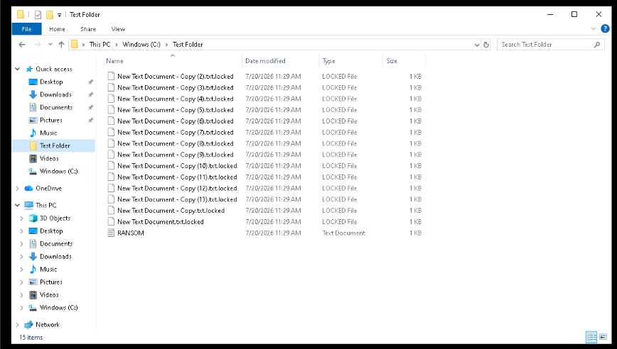
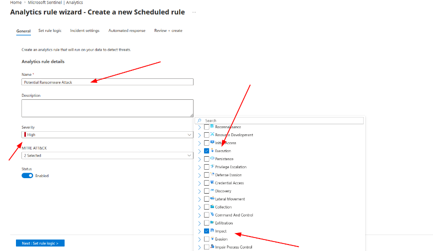
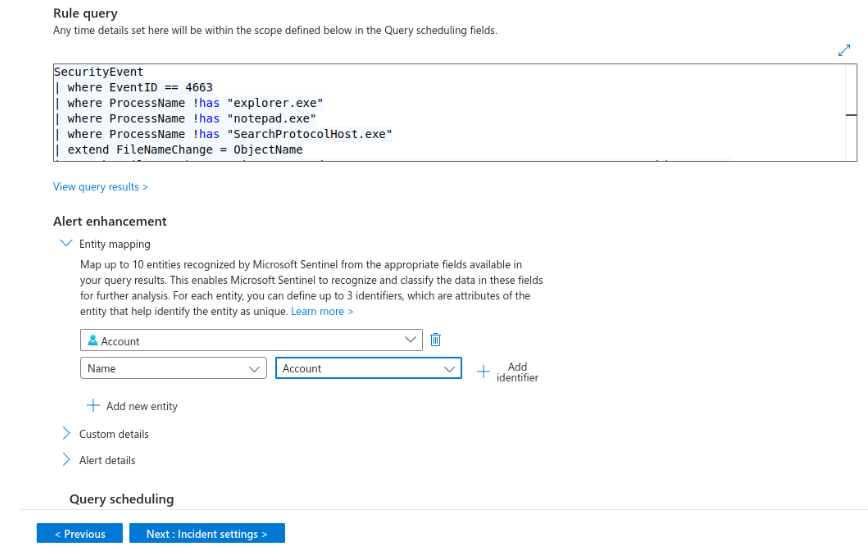
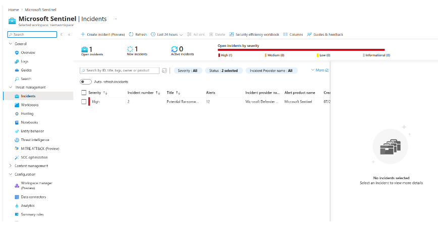
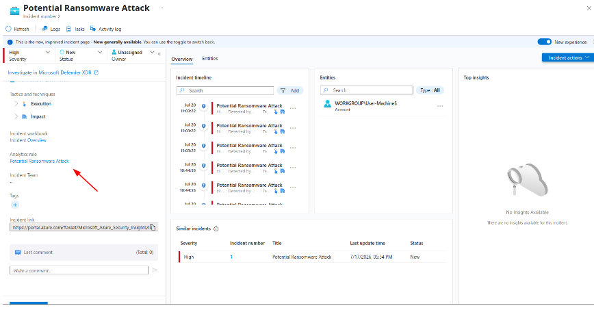

# Lab 03: Ransomware Behavioral Analytics & Sentinel Incident Triage

## Overview
This module demonstrates detection engineering against bulk file encryption attacks. A simulated ransomware binary was executed against local user directories, triggering a scheduled KQL analytics rule, automated alert grouping, and an investigative incident in Microsoft Sentinel.

---

## 1. Attack Simulation: Cryptographic Locking

1. **Execution:** Executed `ransomware.exe` against target directory `C:\Test Folder\`.
2. **Impact:** System files were bulk-encrypted, modified with the extension `.txt.locked`, and dropped a ransom demand document.



---

## 2. Detection Rule Engineering

### Analytics Rule Specification
* **Rule Name:** `Potential Ransomware Attack`
* **Severity:** High
* **MITRE ATT&CK Mapping:** Execution (TA0002), Impact (TA0040)
* **Scheduling:** Query runs every 5 minutes looking back over the last 1 hour
* **Threshold:** Trigger alert when results are greater than 10

### KQL Detection Query (Object Access Anomalies)
Filters Event ID 4663 (An attempt was made to access an object) to exclude standard benign processes while detecting high-volume file modification activity:

```kql
SecurityEvent
| where EventID == 4663
| where ProcessName !has "explorer.exe"
| where ProcessName !has "notepad.exe"
| where ProcessName !has "SearchProtocolHost.exe"
| extend FileNameChange = ObjectName
| sort by FileNameChange, TimeGenerated, AccountType, Account, Computer, ProcessName, ObjectServer
```



### Entity Mapping & Alert Grouping
* **Entity Mapping:** Mapped entity `Account` $\rightarrow$ `Account Name` to allow automated investigation graphing.
* **Incident Grouping:** Enabled alert grouping into a single incident if all entities match across a 5-hour window, reducing alert fatigue.



---

## 3. SOC Incident Triage & Investigation

Following attack execution, Microsoft Sentinel correlated the telemetry into an actionable High-Severity incident.

1. **Incident Attribution:** Assigned to `Potential Ransomware Attack`.
2. **Entity Context:** Identified impacted host `User-Machine` and compromised account `Administrator1`.
3. **Investigation Workflow:** Enabled analyst pivoting into related event logs and timeline events.



