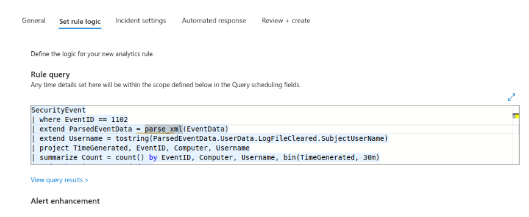
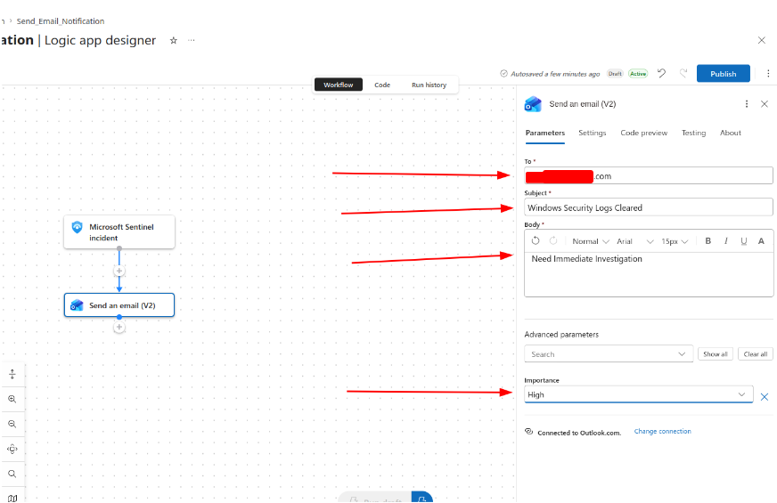
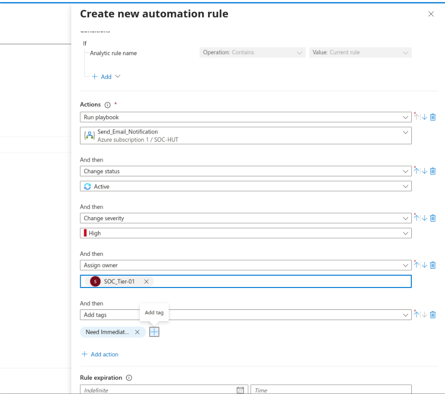
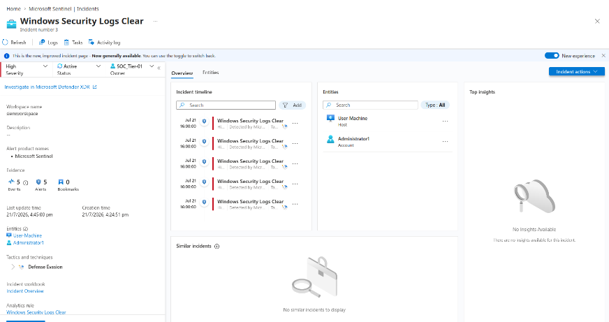

# Lab 04: SOAR Automation, Incident Enrichment & Playbook Orchestration

## Overview
This module configures automated incident detection and response (SOAR) using Azure Logic Apps and Microsoft Sentinel Automation Rules. An alert detecting Windows Security Log clearing initiates automated owner assignment, severity tagging, and email dispatch to the incident response team.

---

## 1. Defense Evasion Detection: Audit Log Tampering

### Threat Logic
Adversaries clear Windows Event Logs (`wevtutil cl Security`) to remove traces of credential dumping, persistence installation, and lateral movement

### Analytics Rule Configuration
* **Name:** `Windows Security Logs Clear`
* **Severity:** High
* **MITRE ATT&CK:** Defense Evasion (TA0005) - T1070.001 (Clear Windows Event Logs)

```kql
SecurityEvent
| where EventID == 1102
| extend ParsedEventData = parse_xml(EventData)
| extend Username = tostring(ParsedEventData.UserData.LogFileCleared.SubjectUserName)
| project TimeGenerated, EventID, Computer, Username
| summarize Count = count() by EventID, Computer, Username, bin(TimeGenerated, 30m)
| order by TimeGenerated desc
```



---

## 2. SOAR Logic App Playbook Construction

Deployed a playbook with an incident trigger named `Send_Email_Notification`:

1. **Trigger:** `When a Microsoft Sentinel incident creation rule was triggered`.
2. **Action (`Send an email (V2)`):**
   * Configured via Office 365 Outlook connector.
   * Subject: `Windows Security Logs Cleared`
   * Importance: `High`
   * Body: Dispatches immediate triage instructions.



---

## 3. Automation Rule & RBAC Integration

### IAM Role Assignment
Granted `Logic App Contributor` permissions to the Sentinel automation principal within resource group `SOC-HUT`.

### Automation Rule (`Windows Security Log Clear Response`)
When an incident is triggered from rule `Windows Security Logs Clear`, execute these automated actions:
* **Run Playbook:** `Send_Email_Notification`
* **Change Status:** `Active`
* **Change Severity:** `High`
* **Assign Owner:** `SOC_Tier-01`
* **Add Tag:** `Need Immediate Investigation`



---

## 4. Attack Validation & Automated Execution

1. Executed anti-forensics log clearing on target machine:
   ```cmd
   wevtutil cl Security
   ```
2. Sentinel detected Event ID 1102, created the incident, enriched metadata, and ran the playbook automatically.



