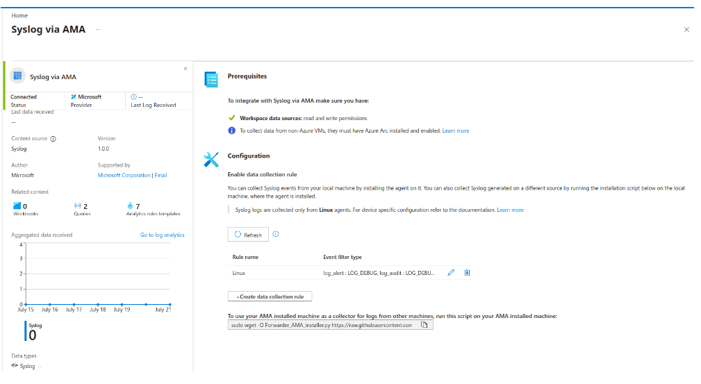
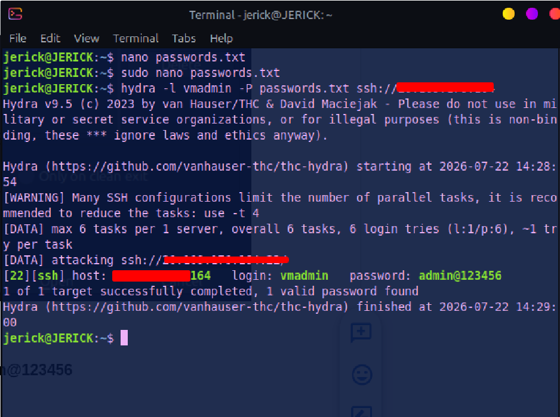
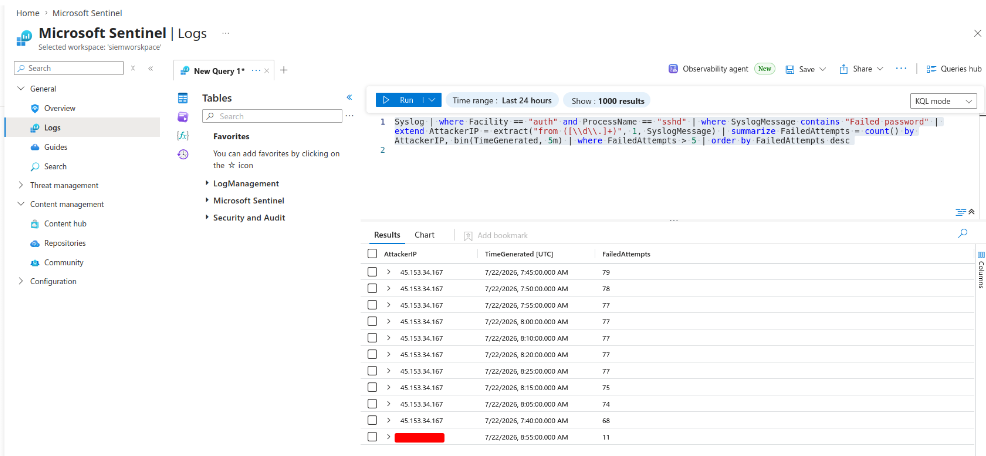
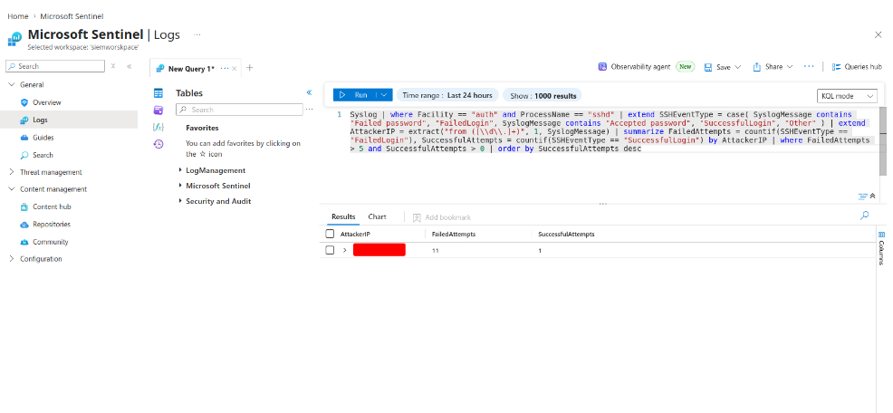
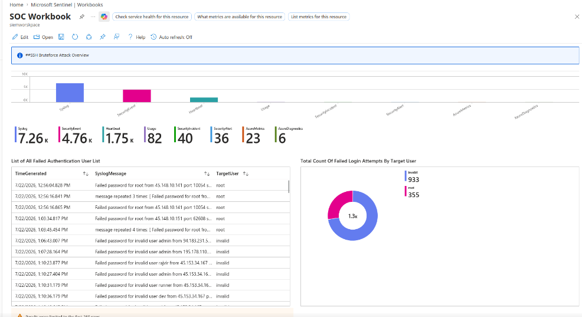

# Lab 05: Linux Telemetry Ingestion, SSH Brute-Force & Custom Workbooks

## Overview
This module demonstrates telemetry ingestion from Linux workloads into Microsoft Sentinel using the Syslog via AMA connector, detects network brute-force attacks launched via Hydra, and visualizes SOC metrics using interactive Azure Workbooks[cite: 3].

---

## 1. Linux Workload Ingestion via Syslog AMA

1. **Target Machine:** Deployed `User-Machine-01` running Ubuntu Server 24.04 LTS[cite: 3].
2. **Data Connector:** Configured **Syslog via AMA** from the Content Hub[cite: 3].
3. **Data Collection Rule (`Linux`):** Ingested all log facilities with minimum log level `LOG_DEBUG`[cite: 3].



---

## 2. Adversary Emulation: Distributed SSH Brute-Force

Simulated password spraying and dictionary attacks against target port 22 using Hydra[cite: 3]:

```cmd
hydra.exe -L user.txt -P pass.txt ssh://<UBUNTU_PUBLIC_IP>
```



---

## 3. High-Fidelity KQL Detection Analytics

### Query 1: Failed Password Anomalies by Attacker IP
Extracts the attacker IP from raw auth log strings and aggregates attempts in 5-minute bins[cite: 3]:

```kql
Syslog
| where Facility == "auth" and ProcessName == "sshd"
| where SyslogMessage contains "Failed password"
| extend AttackerIP = extract(@"from ([\d\.]+)", 1, SyslogMessage)
| summarize FailedAttempts = count() by AttackerIP, bin(TimeGenerated, 5m)
| where FailedAttempts > 5
| order by FailedAttempts desc
```



### Query 2: Compromised Host Detection (Success Post-Brute-Force)
Correlates IP addresses generating more than 5 failed logins that subsequently achieve a successful authentication (`Accepted password`)[cite: 3]:

```kql
Syslog
| where Facility == "auth" and ProcessName == "sshd"
| extend SSHEventType = case(
    SyslogMessage contains "Failed password", "FailedLogin",
    SyslogMessage contains "Accepted password", "SuccessfulLogin",
    "Other"
)
| extend AttackerIP = extract(@"from ([\d\.]+)", 1, SyslogMessage)
| summarize 
    FailedAttempts = countif(SSHEventType == "FailedLogin"),
    SuccessfulAttempts = countif(SSHEventType == "SuccessfulLogin")
    by AttackerIP
| where FailedAttempts > 5 and SuccessfulAttempts > 0
| order by SuccessfulAttempts desc
```



---

## 4. Custom SOC Operational Workbook

Designed an Azure Workbook titled **`SOC Workbook`** containing operational visual panels[cite: 3]:

* **Failed Authentication User List:** Pinned table listing targeted accounts (`extract(@"for ([^\s]+)", 1, SyslogMessage)`)[cite: 3].
* **Failed Attempts by Target User:** Pie chart summarizing brute-force impact across usernames[cite: 3].
* **Attack Pattern Over Time:** Area timeline mapping attempt velocity[cite: 3].
* **Logon Attempt Frequency by IP:** Bar chart tracking top attacking sources[cite: 3].
* **Breach Identification Panel:** Highlighting attacker IPs that successfully gained interactive access[cite: 3].


